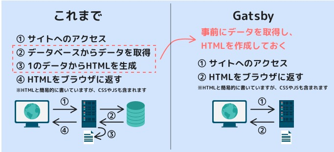

## 日進月歩のフロントエンド開発技術
- ウェブ開発における新しい技術の誕生と成長は盛んに繰り返されている  
- 特にフロントエンド開発において、その成長は著しいもの  
- 新しい技術が次から次へと出てきて追いつくのが大変だが、それほど進歩、伸びしろのある領域 
- 昨今のフロントエンド開発のトレンドとして「React」や「Vue」が挙げられる
- これらが多くの技術者、既存のサービスから選ばれている理由
>- サイトパフォーマンス改善
>- 複雑な常態遷移の向上（値の常態管理、画面遷移など）
>- 開発体験の向上（コーディングが少ない、メンテナンスしやすい）
>- パフォーマンスという点ではECサイトにおいてページの表示速度が速いほど購入率が高まるというデータがある
>- ReactやVueの特徴である仮想DOMは、描画時に前後の状態を比較し差分だけを描画することでパフォーマンス改善が見込める
#### Gatsbyとは
- Gatsbyは爆速なサイトを簡単に構築するためのReact製のフレームワーク
- 検索上位に表示されるかどうかといったSEOにおいても速さは評価の指標のひとつ
- Gatsbyでは少ない知識で簡単に本格的なサービスをリリースすることが出来る環境が提供される  
#### Gatsbyが爆速な理由
▼ 一般的なブログやニュースなどのWebサイトの構成
>- 記事のデータをデータベースに保存
>- サイトにユーザーからのアクセスが来る
>- サーバー上でHTMLを生成する
>- 生成したHTMLをユーザーへ表示する  
▼ 上記のように一般的なサイトでは効率が良くないポイントが２つある
>- データベースへの問い合わせ
>- サーバー上でのHTMLの生成
▼ 効率が良くないポイントに対して考えられたGatsby
- 記事データ(静的データ)は一度作成された後は更新されることは少ない
- 更新頻度の少ないデータに対して毎回データベースに問い合わせる必要はない
- また、データが変わらなければ生成するHTMLも変わらない
- つまり、事前にデータを1度だけ取得しあらかじめHTMLを生成しておき、アクセスが来たらそのHTMLを返すようにすれば、サーバーとデータベースの仕事が少なくなって効率的
- Gatsbyでは、このような手法でサイトを作成することができる
- 静的なページを事前に作っておくことから、「静的サイトジェネレーター(Static Site Generator 略してSSG)」と呼ばれている

▲ 作り置きしておくイメージ  
- では記事データ（静的データ）が新規追加、更新された時はどうするかの疑問点
- これは別記事「Gatsbサイトのデプロイ」で紹介
#### Gatsbyの利点が効かないケース
更新頻度の高いデータ
- 更新頻度の高いデータを扱うSNSやECサイトでは事前にHTMLを作成しておくことは効果を発揮できないだけでなく、データをリアルタイムに更新できずビジネス要件を満たせず逆効果となる場合がある
- このような動的データに関しては静的サイトジェネレーターの恩恵を受けられないことを理解しておく
- 動的データをGatsbyで扱えないわけではない　GatsbyはReact製のフレームワークなので、React（一般的なSPA）で動的データを扱うようにAPI経由でデータ取得し画面に反映すれば動的データを扱うことができる
- 2021/6/18現時点で更新頻度の高いデータのみ扱う場合にはGatsby以外のReact製フレームワーク「Next.js」一択
#### Gatsbyを使用する利点
- パフォーマンス　
- サーバレスな構成で運用しやすい
- データベースを持たなくて良い
- アプリケーションサーバーを持たなくて良い
- Gatsbyプラグインやスターターライブラリを使って手軽にWebサイトを構築できる

## まとめ
- React製のフレームワークでSSGとなればGatsbyかNext.jsの2択
- Next.jsはSSRも可能なので現時点では1択
- それでもGatsbyを使う理由はSSGに特化しているため
- Gatsbyはプラグイン、スターターが豊富なので、迅速にサービスを提供できる

 

